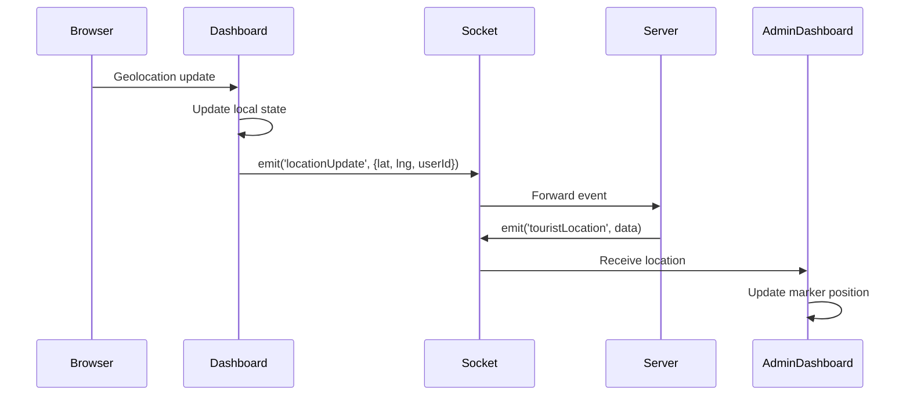
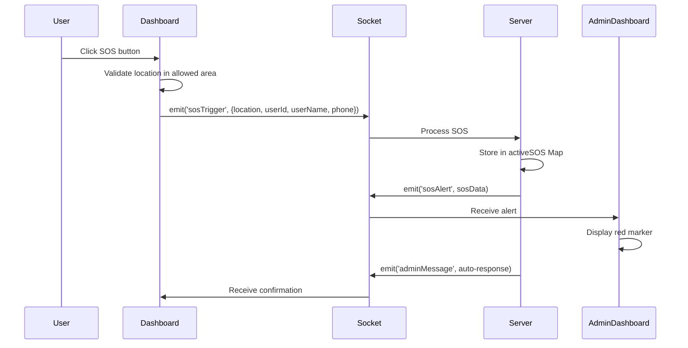

# Design Document: Google Maps Integration

## Overview

This design document specifies the technical implementation for replacing Leaflet/OpenStreetMap with Google Maps JavaScript API in the Net2Vision tourist safety platform. The migration affects both User Dashboard and Admin Dashboard, maintaining all existing functionality while leveraging Google Maps' enhanced capabilities.

### Goals

- Replace Leaflet mapping library with Google Maps JavaScript API v3
- Maintain all existing features: real-time location tracking, SOS alerts, zone overlays, and trails
- Improve performance with marker clustering and optimized rendering
- Apply consistent dark theme styling across all maps
- Ensure mobile responsiveness and touch gesture support
- Preserve Socket.IO real-time communication infrastructure

### Non-Goals

- Changing backend Socket.IO event structure
- Modifying SOS alert business logic
- Altering user authentication or authorization
- Redesigning UI components outside of map integration

### Success Criteria

- All Leaflet dependencies removed from codebase
- Google Maps displays correctly on both dashboards
- Real-time location updates work seamlessly
- Performance supports 100+ concurrent users on admin dashboard
- Mobile experience matches or exceeds current implementation
- Dark theme applied consistently


## Architecture

### High-Level Architecture

```mermaid
graph TB
    subgraph "Client Application"
        HTML[index.html<br/>Google Maps Script]
        
        subgraph "User Dashboard"
            UD[Dashboard.jsx]
            UGM[GoogleMapWrapper]
        end
        
        subgraph "Admin Dashboard"
            AD[AdminDashboard.jsx]
            AGM[GoogleMapWrapper]
        end
        
        subgraph "Shared Components"
            GMW[GoogleMapWrapper.jsx]
            GMAPI[Google Maps API]
        end
    end
    
    subgraph "Backend"
        SERVER[Express Server]
        SOCKET[Socket.IO]
        GEO[/api/geo/map-data]
    end
    
    HTML -->|Loads| GMAPI
    UD -->|Uses| GMW
    AD -->|Uses| GMW
    GMW -->|Initializes| GMAPI
    
    UD <-->|Real-time Events| SOCKET
    AD <-->|Real-time Events| SOCKET
    UD -->|Fetch Zones| GEO
    
    SOCKET -->|locationUpdate| SERVER
    SOCKET -->|sosTrigger| SERVER
    SOCKET -->|touristLocation| AD
    SOCKET -->|sosAlert| AD

```

### Component Architecture

The system follows a layered architecture:

1. **Presentation Layer**: Dashboard.jsx and AdminDashboard.jsx handle UI state and user interactions
2. **Map Abstraction Layer**: GoogleMapWrapper.jsx provides a reusable interface to Google Maps API
3. **Communication Layer**: Socket.IO manages real-time data flow
4. **Data Layer**: Backend API provides zone data and handles SOS events

### Data Flow

#### User Location Update Flow



#### SOS Alert Flow




### State Management Strategy

Both dashboards use React hooks for state management:

- **useState**: Component-local state for map center, zoom, markers, trails
- **useRef**: Persistent references to map instance, marker objects, and recording streams
- **useEffect**: Side effects for Socket.IO listeners, geolocation watching, and data fetching
- **useMemo**: Memoized computations for grouped alerts and filtered data
- **useCallback**: Memoized callbacks to prevent unnecessary re-renders

No global state management library is needed as state is scoped to individual dashboards.


## Components and Interfaces

### GoogleMapWrapper Component

A reusable React component that encapsulates Google Maps API initialization and provides a clean interface for map rendering.

#### Props Interface

```typescript
interface GoogleMapWrapperProps {
  // Map configuration
  center: { lat: number; lng: number };
  zoom: number;
  style?: React.CSSProperties;
  
  // Markers
  markers?: Array<{
    id: string;
    position: { lat: number; lng: number };
    type: 'user' | 'tourist' | 'sos';
    label?: string;
    onClick?: () => void;
  }>;
  
  // Polylines (trails)
  polylines?: Array<{
    id: string;
    path: Array<{ lat: number; lng: number }>;
    color: string;
    weight: number;
    opacity: number;
  }>;
  
  // Circles (zones)
  circles?: Array<{
    id: string;
    center: { lat: number; lng: number };
    radius: number;
    fillColor: string;
    fillOpacity: number;
    strokeColor: string;
    strokeWeight: number;
  }>;
  
  // Clustering
  enableClustering?: boolean;
  clusteringThreshold?: number;
  
  // Callbacks
  onMapLoad?: (map: google.maps.Map) => void;
  onCenterChanged?: (center: { lat: number; lng: number }) => void;
  onZoomChanged?: (zoom: number) => void;
  
  // Mobile
  isMobile?: boolean;
}
```


#### Component Implementation Strategy

```javascript
// Pseudocode for GoogleMapWrapper.jsx

import { useEffect, useRef, useState, useMemo, useCallback } from 'react';
import { MarkerClusterer } from '@googlemaps/markerclusterer';

const GoogleMapWrapper = (props) => {
  const mapRef = useRef(null);
  const mapInstanceRef = useRef(null);
  const markersRef = useRef({});
  const polylinesRef = useRef({});
  const circlesRef = useRef({});
  const clustererRef = useRef(null);
  
  // Initialize map on mount
  useEffect(() => {
    if (!window.google) {
      console.error('Google Maps API not loaded');
      return;
    }
    
    const map = new google.maps.Map(mapRef.current, {
      center: props.center,
      zoom: props.zoom,
      styles: DARK_THEME_STYLES,
      disableDefaultUI: props.isMobile,
      zoomControl: !props.isMobile,
      mapTypeControl: false,
      streetViewControl: false,
      fullscreenControl: !props.isMobile,
    });
    
    mapInstanceRef.current = map;
    props.onMapLoad?.(map);
    
    // Add event listeners
    map.addListener('center_changed', () => {
      const center = map.getCenter();
      props.onCenterChanged?.({ lat: center.lat(), lng: center.lng() });
    });
    
    map.addListener('zoom_changed', () => {
      props.onZoomChanged?.(map.getZoom());
    });
    
    return () => {
      // Cleanup
      Object.values(markersRef.current).forEach(m => m.setMap(null));
      Object.values(polylinesRef.current).forEach(p => p.setMap(null));
      Object.values(circlesRef.current).forEach(c => c.setMap(null));
      clustererRef.current?.clearMarkers();
    };
  }, []);
  
  // Update markers
  useEffect(() => {
    if (!mapInstanceRef.current) return;
    updateMarkers(props.markers, mapInstanceRef.current, markersRef, clustererRef, props.enableClustering);
  }, [props.markers, props.enableClustering]);
  
  // Update polylines
  useEffect(() => {
    if (!mapInstanceRef.current) return;
    updatePolylines(props.polylines, mapInstanceRef.current, polylinesRef);
  }, [props.polylines]);
  
  // Update circles
  useEffect(() => {
    if (!mapInstanceRef.current) return;
    updateCircles(props.circles, mapInstanceRef.current, circlesRef);
  }, [props.circles]);
  
  // Update center
  useEffect(() => {
    if (!mapInstanceRef.current) return;
    mapInstanceRef.current.panTo(props.center);
  }, [props.center]);
  
  // Update zoom
  useEffect(() => {
    if (!mapInstanceRef.current) return;
    mapInstanceRef.current.setZoom(props.zoom);
  }, [props.zoom]);
  
  return <div ref={mapRef} style={{ width: '100%', height: '100%', ...props.style }} />;
};
```


#### Marker Management Strategy

To optimize performance, markers are reused rather than recreated:

```javascript
function updateMarkers(markers, map, markersRef, clustererRef, enableClustering) {
  const currentIds = new Set(Object.keys(markersRef.current));
  const newIds = new Set(markers.map(m => m.id));
  
  // Remove markers that no longer exist
  currentIds.forEach(id => {
    if (!newIds.has(id)) {
      markersRef.current[id].setMap(null);
      delete markersRef.current[id];
    }
  });
  
  // Add or update markers
  markers.forEach(markerData => {
    if (markersRef.current[markerData.id]) {
      // Update existing marker position
      const marker = markersRef.current[markerData.id];
      marker.setPosition(markerData.position);
    } else {
      // Create new marker
      const marker = new google.maps.Marker({
        position: markerData.position,
        map: map,
        title: markerData.label,
        icon: getMarkerIcon(markerData.type),
      });
      
      if (markerData.onClick) {
        marker.addListener('click', markerData.onClick);
      }
      
      markersRef.current[markerData.id] = marker;
    }
  });
  
  // Handle clustering
  if (enableClustering && markers.length > 50) {
    if (!clustererRef.current) {
      clustererRef.current = new MarkerClusterer({
        map,
        markers: Object.values(markersRef.current).filter(m => !m.isSOS),
      });
    } else {
      clustererRef.current.clearMarkers();
      clustererRef.current.addMarkers(
        Object.values(markersRef.current).filter(m => !m.isSOS)
      );
    }
  } else if (clustererRef.current) {
    clustererRef.current.clearMarkers();
    clustererRef.current = null;
  }
}
```


### Dashboard Component Integration

#### User Dashboard (Dashboard.jsx)

```javascript
// Key changes to Dashboard.jsx

import GoogleMapWrapper from '../components/GoogleMapWrapper';

const Dashboard = () => {
  const [location, setLocation] = useState({ lat: 28.6139, lng: 77.2090 });
  const [path, setPath] = useState([]);
  const [geoData, setGeoData] = useState({ restrictedZones: [], crowdedAreas: [] });
  
  // Convert path array to polyline format
  const polylines = useMemo(() => [{
    id: 'user-trail',
    path: path.map(([lat, lng]) => ({ lat, lng })),
    color: '#3B82F6',
    weight: 4,
    opacity: 0.7,
  }], [path]);
  
  // Convert zones to circles
  const circles = useMemo(() => [
    ...geoData.restrictedZones.map(z => ({
      id: z.id,
      center: z.center,
      radius: z.radius,
      fillColor: '#f59e0b',
      fillOpacity: 0.15,
      strokeColor: '#f59e0b',
      strokeWeight: 2,
    })),
    ...geoData.crowdedAreas.map(a => ({
      id: a.id,
      center: a.center,
      radius: a.radius,
      fillColor: '#ef4444',
      fillOpacity: 0.2,
      strokeColor: '#ef4444',
      strokeWeight: 2,
    })),
  ], [geoData]);
  
  // User marker
  const markers = useMemo(() => [{
    id: 'user',
    position: location,
    type: 'user',
    label: 'You',
  }], [location]);
  
  return (
    <div className="map-container-wrapper">
      <GoogleMapWrapper
        center={location}
        zoom={13}
        markers={markers}
        polylines={polylines}
        circles={circles}
        isMobile={isMobile}
      />
    </div>
  );
};
```


#### Admin Dashboard (AdminDashboard.jsx)

```javascript
// Key changes to AdminDashboard.jsx

import GoogleMapWrapper from '../components/GoogleMapWrapper';

const AdminDashboard = () => {
  const [userLocations, setUserLocations] = useState({});
  const [trails, setTrails] = useState({});
  const [alerts, setAlerts] = useState([]);
  const [users, setUsers] = useState([]);
  
  // Convert user locations to markers
  const markers = useMemo(() => {
    const touristMarkers = Object.entries(userLocations).map(([userId, loc]) => {
      const user = users.find(u => u._id === userId);
      const alert = alerts.find(a => a.userId === userId);
      
      return {
        id: userId,
        position: { lat: loc.lat, lng: loc.lng },
        type: alert ? 'sos' : 'tourist',
        label: user?.name || user?.username || 'Tourist',
        onClick: () => handleMarkerClick(userId, alert),
      };
    });
    
    return touristMarkers;
  }, [userLocations, alerts, users]);
  
  // Convert trails to polylines
  const polylines = useMemo(() => {
    return Object.entries(trails).map(([userId, trail]) => ({
      id: `trail-${userId}`,
      path: trail.map(([lat, lng]) => ({ lat, lng })),
      color: '#3B82F6',
      weight: 3,
      opacity: 0.7,
    }));
  }, [trails]);
  
  const handleMarkerClick = (userId, alert) => {
    if (alert) {
      handleAlertSelect(alert);
    } else {
      const user = users.find(u => u._id === userId);
      if (user) handleUserSelect(user);
    }
  };
  
  return (
    <div className="map-section">
      <GoogleMapWrapper
        center={mobileMapCenter}
        zoom={mobileMapZoom}
        markers={markers}
        polylines={polylines}
        enableClustering={true}
        clusteringThreshold={50}
        isMobile={isMobile}
        onMapLoad={(map) => {
          // Set bounds to India
          const bounds = new google.maps.LatLngBounds(
            { lat: 6.4627, lng: 68.1097 },
            { lat: 35.5133, lng: 97.3956 }
          );
          map.fitBounds(bounds);
        }}
      />
    </div>
  );
};
```


## Data Models

### Location Data Structure

```typescript
interface Location {
  lat: number;  // Latitude in decimal degrees
  lng: number;  // Longitude in decimal degrees
}
```

### Marker Data Structure

```typescript
interface MarkerData {
  id: string;                    // Unique identifier (userId or custom ID)
  position: Location;            // Geographic coordinates
  type: 'user' | 'tourist' | 'sos';  // Marker type for styling
  label?: string;                // Display name
  onClick?: () => void;          // Click handler
  isSOS?: boolean;               // Flag for clustering exclusion
}
```

### Trail/Polyline Data Structure

```typescript
interface PolylineData {
  id: string;                    // Unique identifier
  path: Location[];              // Array of coordinates
  color: string;                 // Hex color code
  weight: number;                // Line thickness in pixels
  opacity: number;               // Opacity (0-1)
}
```

### Zone Data Structure

```typescript
interface ZoneData {
  id: string;                    // Unique identifier
  center: Location;              // Center point
  radius: number;                // Radius in meters
  name?: string;                 // Zone name
  type: 'restricted' | 'crowded'; // Zone type
}

interface CircleData {
  id: string;
  center: Location;
  radius: number;
  fillColor: string;             // Hex color code
  fillOpacity: number;           // Fill opacity (0-1)
  strokeColor: string;           // Border color
  strokeWeight: number;          // Border thickness
}
```


### SOS Alert Data Structure

```typescript
interface SOSAlert {
  id: string;                    // Unique alert ID
  userId: string;                // User who triggered SOS
  userName?: string;             // User's display name
  phone?: string;                // User's phone number
  location: Location;            // Alert location
  area: string;                  // Matched allowed area name
  time: Date;                    // Alert timestamp
  updatedAt: Date;               // Last update timestamp
  status: 'pending' | 'in_progress' | 'resolved';
  count: number;                 // Number of repeated alerts
}
```

### User Location State

```typescript
interface UserLocationState {
  [userId: string]: {
    lat: number;
    lng: number;
    time: number;                // Timestamp of last update
  };
}
```

### Trail State

```typescript
interface TrailState {
  [userId: string]: Array<[number, number]>;  // Array of [lat, lng] tuples
}
```

### Geo Data Response

```typescript
interface GeoDataResponse {
  restrictedZones: Array<{
    id: string;
    center: Location;
    radius: number;
    name: string;
  }>;
  crowdedAreas: Array<{
    id: string;
    center: Location;
    radius: number;
    crowdLevel: string;
    name: string;
  }>;
  landmarks: Array<{
    id: string;
    name: string;
    location: Location;
  }>;
  weatherAlerts: Array<{
    id: string;
    message: string;
    severity: string;
  }>;
  emergencyUpdates: Array<{
    id: string;
    message: string;
    severity: string;
  }>;
}
```


## Correctness Properties

*A property is a characteristic or behavior that should hold true across all valid executions of a system-essentially, a formal statement about what the system should do. Properties serve as the bridge between human-readable specifications and machine-verifiable correctness guarantees.*

### Property Reflection

After analyzing all acceptance criteria, I identified the following redundancies:
- Properties 3.3, 6.4, and 13.3 all test trail size limiting - combined into one property
- Properties 3.4 and 6.5 both test marker reuse - combined into one property
- Properties 1.3 and 15.1 both test package.json cleanup - combined into one property
- Properties 1.4 and 15.3 both test CSS import removal - combined into one property
- Properties 2.3 and 5.4 both test dark theme application - combined into one property
- Properties 7.1 and 13.4 test clustering thresholds (50 vs 100) - kept separate as they test different thresholds

### Property 1: Google Maps API Initialization Order

*For any* map component render attempt, the Google Maps API (window.google) must be loaded and available before the component attempts to create a map instance.

**Validates: Requirements 1.2**

### Property 2: API Loading Error Handling

*For any* Google Maps API loading failure, the system must display a user-friendly error message rather than crashing or showing a blank screen.

**Validates: Requirements 1.5**

### Property 3: User Dashboard Map Centering

*For any* user location update on the User Dashboard, the map center must be updated to match the new user location coordinates.

**Validates: Requirements 2.1, 2.4**

### Property 4: User Location Marker Presence

*For any* valid user location, a marker must be rendered on the map at those exact coordinates.

**Validates: Requirements 2.2**


### Property 5: Responsive Map Controls

*For any* viewport width, map controls must be hidden when width < 640px (mobile) and visible when width >= 640px (desktop).

**Validates: Requirements 2.6, 9.1**

### Property 6: Trail Accumulation

*For any* location update, the new coordinates must be appended to the path trail array.

**Validates: Requirements 3.1, 6.3**

### Property 7: Trail Size Limiting

*For any* trail array (user or tourist), the array length must never exceed its configured maximum (300 for user, 100 for tourists).

**Validates: Requirements 3.3, 6.4, 13.3**

### Property 8: Marker Reuse Optimization

*For any* location update for an existing marker, the same marker object must be reused (position updated) rather than creating a new marker object.

**Validates: Requirements 3.4, 6.5, 13.1**

### Property 9: Speed Calculation

*For any* two consecutive location updates with valid coordinates and timestamps, the calculated speed must be derived from the distance and time difference.

**Validates: Requirements 3.5**

### Property 10: Proximity Warning Trigger

*For any* user location within 500 meters of a restricted zone boundary (but outside the zone), a proximity warning must be displayed.

**Validates: Requirements 4.3**

### Property 11: Zone Containment Detection

*For any* user location within the radius of a crowded area, a caution message must be displayed.

**Validates: Requirements 4.4**

### Property 12: Active Tourist Marker Rendering

*For any* active tourist in the userLocations state, a corresponding marker must be rendered on the Admin Dashboard map.

**Validates: Requirements 5.2**


### Property 13: SOS Marker Styling

*For any* SOS alert, the corresponding marker must be rendered with red styling to distinguish it from regular tourist markers.

**Validates: Requirements 5.3**

### Property 14: Active Tourist Count Display

*For any* state of active tourists, the displayed count must match the number of tourists in the activeUsers array.

**Validates: Requirements 5.6**

### Property 15: Clustering Activation Threshold

*For any* marker count exceeding 50 on the Admin Dashboard, marker clustering must be automatically enabled.

**Validates: Requirements 7.1**

### Property 16: Cluster Count Accuracy

*For any* marker cluster, the displayed count must match the actual number of markers contained in that cluster.

**Validates: Requirements 7.3**

### Property 17: Cluster Zoom Interaction

*For any* cluster click event, the map zoom level must increase to reveal the individual markers within that cluster.

**Validates: Requirements 7.4**

### Property 18: SOS Marker Clustering Exclusion

*For any* SOS alert marker, it must never be included in a marker cluster regardless of proximity to other markers.

**Validates: Requirements 7.5**

### Property 19: Tourist Info Window Content

*For any* tourist marker click on Admin Dashboard, the displayed info window must contain the user's name, ID, and location coordinates.

**Validates: Requirements 8.1**

### Property 20: SOS Info Window Content

*For any* SOS marker click on Admin Dashboard, the displayed info window must contain the user name, area, and alert time.

**Validates: Requirements 8.3**


### Property 21: Single Info Window Display

*For any* marker click event, only one info window must be open at a time (previous info window must be closed).

**Validates: Requirements 8.4**

### Property 22: Mobile Marker Click Behavior

*For any* tourist marker click on mobile Admin Dashboard, the map must center on that marker's location and the active tab must switch to 'chat'.

**Validates: Requirements 8.5**

### Property 23: Mobile Map Viewport Sizing

*For any* mobile User Dashboard with map tab active, the map container dimensions must fill the available viewport.

**Validates: Requirements 9.2**

### Property 24: Mobile User Selection Centering

*For any* user selection from sidebar on mobile Admin Dashboard, the map must center on that user's location with zoom level 15.

**Validates: Requirements 9.3**

### Property 25: Tab Switch Map Resize

*For any* tab switch event on mobile, the map resize method must be called to prevent rendering issues.

**Validates: Requirements 9.5**

### Property 26: Location Update Socket Emission

*For any* user location change, a locationUpdate event must be emitted via Socket.IO containing lat, lng, and userId.

**Validates: Requirements 10.1**

### Property 27: Tourist Location Socket Reception

*For any* touristLocation event received on Admin Dashboard, the corresponding marker position must be updated to the new coordinates.

**Validates: Requirements 10.2**

### Property 28: SOS Trigger Socket Emission

*For any* SOS alert trigger, a sosTrigger event must be emitted via Socket.IO containing location, userId, userName, phone, and time.

**Validates: Requirements 10.3**


### Property 29: SOS Alert Socket Reception

*For any* sosAlert event received on Admin Dashboard, a SOS marker must be added or updated on the map at the alert location.

**Validates: Requirements 10.4**

### Property 30: Socket Event Preservation

*For any* existing Socket.IO event (locationUpdate, sosTrigger, touristLocation, sosAlert, adminMessage, userMessage), the event structure and handling must remain unchanged after migration.

**Validates: Requirements 10.5**

### Property 31: GoogleMapWrapper Lifecycle Management

*For any* GoogleMapWrapper component mount, the Google Maps instance must be initialized, and for any unmount, all map resources (markers, polylines, circles) must be cleaned up.

**Validates: Requirements 11.3**

### Property 32: Marker Update Without Re-render

*For any* marker position update in GoogleMapWrapper, the marker's setPosition method must be called without triggering a full component re-render.

**Validates: Requirements 11.4**

### Property 33: Map Resize Handling

*For any* container dimension change, the GoogleMapWrapper must call the map's resize/invalidateSize method to prevent rendering issues.

**Validates: Requirements 11.5**

### Property 34: Update Debouncing

*For any* rapid sequence of location updates (multiple updates within 100ms), only the most recent update must be processed to prevent excessive re-renders.

**Validates: Requirements 13.2**

### Property 35: High-Volume Clustering

*For any* marker count exceeding 100 on Admin Dashboard, marker clustering must be automatically enabled.

**Validates: Requirements 13.4**

### Property 36: Geolocation API Usage

*For any* User Dashboard load, the browser's geolocation API must be called to obtain the user's current location.

**Validates: Requirements 14.4**


### Property 37: Geolocation Fallback

*For any* geolocation failure or denial, the system must use a fallback location (default coordinates) rather than crashing.

**Validates: Requirements 14.5**


## Error Handling

### Google Maps API Loading Failures

**Scenario**: Google Maps script fails to load due to network issues, invalid API key, or quota exceeded.

**Handling Strategy**:
1. Detect failure by checking `window.google` availability after script load timeout (5 seconds)
2. Display user-friendly error message: "Unable to load map. Please check your internet connection and refresh the page."
3. Provide retry button that reloads the page
4. Log error details to console for debugging

**Implementation**:
```javascript
useEffect(() => {
  const checkGoogleMaps = () => {
    if (!window.google) {
      setMapError('Unable to load map. Please check your internet connection and refresh the page.');
    }
  };
  
  const timer = setTimeout(checkGoogleMaps, 5000);
  return () => clearTimeout(timer);
}, []);
```

### Geolocation Failures

**Scenario**: User denies location permission or geolocation is unavailable.

**Handling Strategy**:
1. Catch geolocation errors in watchPosition error callback
2. Fall back to default location (Delhi: 28.6139, 77.2090)
3. Display informational message: "Location access denied. Using default location."
4. Start simulation mode for testing purposes

**Implementation**:
```javascript
navigator.geolocation.watchPosition(
  successCallback,
  (error) => {
    console.warn('Geolocation failed:', error);
    setLocation({ lat: 28.6139, lng: 77.2090 });
    setLocationError('Location access denied. Using default location.');
    startSimulation();
  },
  { enableHighAccuracy: true }
);
```


### Socket.IO Connection Failures

**Scenario**: Real-time connection to server fails or disconnects.

**Handling Strategy**:
1. Socket.IO automatically handles reconnection attempts
2. Display connection status indicator in UI
3. Queue location updates during disconnection
4. Flush queued updates on reconnection

**Implementation**:
```javascript
socket.on('connect', () => {
  setConnectionStatus('connected');
  flushQueuedUpdates();
});

socket.on('disconnect', () => {
  setConnectionStatus('disconnected');
});
```

### Invalid Location Data

**Scenario**: Received location data has invalid coordinates (NaN, null, out of range).

**Handling Strategy**:
1. Validate coordinates before processing: lat must be -90 to 90, lng must be -180 to 180
2. Ignore invalid updates and log warning
3. Maintain last known valid location

**Implementation**:
```javascript
const isValidLocation = (lat, lng) => {
  return typeof lat === 'number' && typeof lng === 'number' &&
         !isNaN(lat) && !isNaN(lng) &&
         lat >= -90 && lat <= 90 &&
         lng >= -180 && lng <= 180;
};

socket.on('touristLocation', (data) => {
  if (!isValidLocation(data.lat, data.lng)) {
    console.warn('Invalid location data:', data);
    return;
  }
  updateMarkerPosition(data.userId, data.lat, data.lng);
});
```

### Marker Clustering Failures

**Scenario**: MarkerClusterer library fails to load or initialize.

**Handling Strategy**:
1. Wrap clustering initialization in try-catch
2. Fall back to displaying all markers without clustering
3. Log error for debugging

**Implementation**:
```javascript
try {
  clustererRef.current = new MarkerClusterer({
    map,
    markers: Object.values(markersRef.current),
  });
} catch (error) {
  console.error('Clustering failed:', error);
  // Continue without clustering
}
```


## Testing Strategy

### Dual Testing Approach

The testing strategy employs both unit tests and property-based tests to ensure comprehensive coverage:

- **Unit Tests**: Verify specific examples, edge cases, error conditions, and integration points
- **Property-Based Tests**: Verify universal properties across randomized inputs

Both approaches are complementary and necessary for complete validation.

### Unit Testing

Unit tests focus on:
- Specific configuration values (zoom levels, colors, API keys)
- Component rendering with known inputs
- Error handling with specific failure scenarios
- Integration between components
- Socket.IO event emission and reception
- Edge cases (empty arrays, null values, boundary conditions)

**Testing Framework**: Jest + React Testing Library

**Example Unit Tests**:

```javascript
describe('GoogleMapWrapper', () => {
  test('renders map container with correct dimensions', () => {
    render(<GoogleMapWrapper center={{lat: 0, lng: 0}} zoom={10} />);
    const container = screen.getByTestId('map-container');
    expect(container).toHaveStyle({ width: '100%', height: '100%' });
  });
  
  test('applies dark theme styles on initialization', () => {
    const onMapLoad = jest.fn();
    render(<GoogleMapWrapper center={{lat: 0, lng: 0}} zoom={10} onMapLoad={onMapLoad} />);
    expect(onMapLoad).toHaveBeenCalledWith(expect.objectContaining({
      styles: expect.arrayContaining([expect.objectContaining({ stylers: expect.any(Array) })])
    }));
  });
  
  test('displays error message when Google Maps fails to load', () => {
    window.google = undefined;
    render(<GoogleMapWrapper center={{lat: 0, lng: 0}} zoom={10} />);
    expect(screen.getByText(/unable to load map/i)).toBeInTheDocument();
  });
});

describe('Dashboard', () => {
  test('emits locationUpdate event when location changes', () => {
    const mockEmit = jest.fn();
    socket.emit = mockEmit;
    
    const { rerender } = render(<Dashboard />);
    act(() => {
      setLocation({ lat: 28.6139, lng: 77.2090 });
    });
    
    expect(mockEmit).toHaveBeenCalledWith('locationUpdate', expect.objectContaining({
      lat: 28.6139,
      lng: 77.2090,
      userId: expect.any(String)
    }));
  });
});
```


### Property-Based Testing

Property-based tests verify universal properties across many randomized inputs (minimum 100 iterations per test).

**Testing Framework**: fast-check (JavaScript property-based testing library)

**Configuration**:
- Minimum 100 iterations per property test
- Each test tagged with: `Feature: google-maps-integration, Property {number}: {property_text}`

**Example Property-Based Tests**:

```javascript
import fc from 'fast-check';

describe('Property-Based Tests: google-maps-integration', () => {
  test('Feature: google-maps-integration, Property 6: Trail Accumulation', () => {
    fc.assert(
      fc.property(
        fc.array(fc.record({ lat: fc.float(-90, 90), lng: fc.float(-180, 180) })),
        (locations) => {
          const trail = [];
          locations.forEach(loc => {
            trail.push([loc.lat, loc.lng]);
          });
          // Property: Each location update adds to trail
          expect(trail.length).toBe(locations.length);
        }
      ),
      { numRuns: 100 }
    );
  });
  
  test('Feature: google-maps-integration, Property 7: Trail Size Limiting', () => {
    fc.assert(
      fc.property(
        fc.array(fc.record({ lat: fc.float(-90, 90), lng: fc.float(-180, 180) }), { minLength: 0, maxLength: 500 }),
        fc.integer(50, 300),
        (locations, maxSize) => {
          const trail = [];
          locations.forEach(loc => {
            trail.push([loc.lat, loc.lng]);
            if (trail.length > maxSize) trail.shift();
          });
          // Property: Trail never exceeds max size
          expect(trail.length).toBeLessThanOrEqual(maxSize);
        }
      ),
      { numRuns: 100 }
    );
  });
  
  test('Feature: google-maps-integration, Property 10: Proximity Warning Trigger', () => {
    fc.assert(
      fc.property(
        fc.record({ lat: fc.float(-90, 90), lng: fc.float(-180, 180) }),
        fc.record({ 
          center: fc.record({ lat: fc.float(-90, 90), lng: fc.float(-180, 180) }),
          radius: fc.integer(100, 10000)
        }),
        (userLoc, zone) => {
          const distance = calculateDistance(userLoc, zone.center);
          const isNearZone = distance > zone.radius && distance - zone.radius <= 500;
          const warningShown = checkProximityWarning(userLoc, zone);
          
          // Property: Warning shown iff within 500m of zone boundary
          expect(warningShown).toBe(isNearZone);
        }
      ),
      { numRuns: 100 }
    );
  });
  
  test('Feature: google-maps-integration, Property 12: Active Tourist Marker Rendering', () => {
    fc.assert(
      fc.property(
        fc.array(fc.record({ 
          userId: fc.string(),
          lat: fc.float(-90, 90),
          lng: fc.float(-180, 180)
        }), { maxLength: 200 }),
        (tourists) => {
          const userLocations = {};
          tourists.forEach(t => {
            userLocations[t.userId] = { lat: t.lat, lng: t.lng };
          });
          
          const markers = createMarkersFromLocations(userLocations);
          
          // Property: Each active tourist has a marker
          expect(markers.length).toBe(Object.keys(userLocations).length);
          Object.keys(userLocations).forEach(userId => {
            expect(markers.some(m => m.id === userId)).toBe(true);
          });
        }
      ),
      { numRuns: 100 }
    );
  });
});
```


### Integration Testing

Integration tests verify the interaction between components and external systems:

- Google Maps API initialization and map rendering
- Socket.IO event flow between client and server
- Real-time location updates end-to-end
- SOS alert flow from trigger to admin display
- Mobile responsive behavior across breakpoints

**Testing Approach**:
1. Use mock Socket.IO server for controlled event testing
2. Use Google Maps JavaScript API test utilities or mocks
3. Test responsive behavior with viewport size changes
4. Verify event propagation through component tree

### Performance Testing

Performance tests ensure the system handles high load:

- **Marker Rendering**: Test with 100+ concurrent markers
- **Trail Updates**: Test rapid location updates (10+ per second)
- **Clustering**: Verify clustering activates at correct thresholds
- **Memory Leaks**: Verify proper cleanup on component unmount
- **Re-render Optimization**: Verify useMemo/useCallback prevent unnecessary renders

**Performance Benchmarks**:
- Map initialization: < 1 second
- Marker position update: < 16ms (60 FPS)
- Trail rendering with 300 points: < 50ms
- Clustering 100+ markers: < 100ms

### Manual Testing Checklist

- [ ] Google Maps loads correctly on all supported browsers
- [ ] Dark theme applied consistently
- [ ] User location marker displays and updates smoothly
- [ ] Path trail renders correctly and limits to 300 points
- [ ] Restricted zones and crowded areas display with correct colors
- [ ] Proximity warnings trigger at correct distances
- [ ] Admin dashboard displays all active tourists
- [ ] SOS alerts show red markers
- [ ] Marker clustering works with 50+ users
- [ ] Info windows display correct information
- [ ] Mobile responsive behavior works on iOS and Android
- [ ] Touch gestures work for panning and zooming
- [ ] Tab switching resizes map correctly
- [ ] Socket.IO events transmit in real-time
- [ ] No Leaflet references remain in codebase


## Implementation Details

### Google Maps Script Loading

**File**: `client/index.html`

Add Google Maps script tag in the `<head>` section:

```html
<head>
  <!-- Existing meta tags -->
  <script 
    src="https://maps.googleapis.com/maps/api/js?key=GOOGLE_MAPS_API_KEY_PLACEHOLDER&libraries=marker"
    async
    defer
  ></script>
</head>
```

**Rationale**: 
- `async` allows HTML parsing to continue while script loads
- `defer` ensures script executes after DOM is ready
- `libraries=marker` loads advanced marker features

### Dark Theme Configuration

**File**: `client/src/components/GoogleMapWrapper.jsx`

Define dark theme styles as a constant:

```javascript
const DARK_THEME_STYLES = [
  { elementType: 'geometry', stylers: [{ color: '#1e293b' }] },
  { elementType: 'labels.text.stroke', stylers: [{ color: '#0f172a' }] },
  { elementType: 'labels.text.fill', stylers: [{ color: '#94a3b8' }] },
  {
    featureType: 'administrative.locality',
    elementType: 'labels.text.fill',
    stylers: [{ color: '#cbd5e1' }]
  },
  {
    featureType: 'poi',
    elementType: 'labels.text.fill',
    stylers: [{ color: '#64748b' }]
  },
  {
    featureType: 'poi.park',
    elementType: 'geometry',
    stylers: [{ color: '#1e3a2f' }]
  },
  {
    featureType: 'poi.park',
    elementType: 'labels.text.fill',
    stylers: [{ color: '#6b9080' }]
  },
  {
    featureType: 'road',
    elementType: 'geometry',
    stylers: [{ color: '#334155' }]
  },
  {
    featureType: 'road',
    elementType: 'geometry.stroke',
    stylers: [{ color: '#1e293b' }]
  },
  {
    featureType: 'road.highway',
    elementType: 'geometry',
    stylers: [{ color: '#475569' }]
  },
  {
    featureType: 'road.highway',
    elementType: 'geometry.stroke',
    stylers: [{ color: '#1e293b' }]
  },
  {
    featureType: 'water',
    elementType: 'geometry',
    stylers: [{ color: '#0f172a' }]
  },
  {
    featureType: 'water',
    elementType: 'labels.text.fill',
    stylers: [{ color: '#475569' }]
  }
];
```


### Marker Icon Configuration

Define custom marker icons for different types:

```javascript
const getMarkerIcon = (type) => {
  switch (type) {
    case 'user':
      return {
        path: google.maps.SymbolPath.CIRCLE,
        scale: 10,
        fillColor: '#3b82f6',
        fillOpacity: 1,
        strokeColor: '#ffffff',
        strokeWeight: 2,
      };
    case 'tourist':
      return {
        path: google.maps.SymbolPath.CIRCLE,
        scale: 8,
        fillColor: '#10b981',
        fillOpacity: 1,
        strokeColor: '#ffffff',
        strokeWeight: 2,
      };
    case 'sos':
      return {
        path: google.maps.SymbolPath.CIRCLE,
        scale: 12,
        fillColor: '#ef4444',
        fillOpacity: 1,
        strokeColor: '#ffffff',
        strokeWeight: 3,
        animation: google.maps.Animation.BOUNCE,
      };
    default:
      return null;
  }
};
```

### Polyline and Circle Rendering

Helper functions for rendering overlays:

```javascript
function updatePolylines(polylines, map, polylinesRef) {
  const currentIds = new Set(Object.keys(polylinesRef.current));
  const newIds = new Set(polylines.map(p => p.id));
  
  // Remove old polylines
  currentIds.forEach(id => {
    if (!newIds.has(id)) {
      polylinesRef.current[id].setMap(null);
      delete polylinesRef.current[id];
    }
  });
  
  // Add or update polylines
  polylines.forEach(polylineData => {
    if (polylinesRef.current[polylineData.id]) {
      // Update existing polyline
      polylinesRef.current[polylineData.id].setPath(polylineData.path);
    } else {
      // Create new polyline
      const polyline = new google.maps.Polyline({
        path: polylineData.path,
        geodesic: true,
        strokeColor: polylineData.color,
        strokeOpacity: polylineData.opacity,
        strokeWeight: polylineData.weight,
        map: map,
      });
      polylinesRef.current[polylineData.id] = polyline;
    }
  });
}

function updateCircles(circles, map, circlesRef) {
  const currentIds = new Set(Object.keys(circlesRef.current));
  const newIds = new Set(circles.map(c => c.id));
  
  // Remove old circles
  currentIds.forEach(id => {
    if (!newIds.has(id)) {
      circlesRef.current[id].setMap(null);
      delete circlesRef.current[id];
    }
  });
  
  // Add or update circles
  circles.forEach(circleData => {
    if (circlesRef.current[circleData.id]) {
      // Update existing circle
      const circle = circlesRef.current[circleData.id];
      circle.setCenter(circleData.center);
      circle.setRadius(circleData.radius);
    } else {
      // Create new circle
      const circle = new google.maps.Circle({
        center: circleData.center,
        radius: circleData.radius,
        fillColor: circleData.fillColor,
        fillOpacity: circleData.fillOpacity,
        strokeColor: circleData.strokeColor,
        strokeWeight: circleData.strokeWeight,
        map: map,
      });
      circlesRef.current[circleData.id] = circle;
    }
  });
}
```


### Debouncing Location Updates

Implement debouncing to prevent excessive re-renders:

```javascript
import { useCallback, useRef } from 'react';

const useDebouncedLocationUpdate = (delay = 100) => {
  const timeoutRef = useRef(null);
  
  const debouncedUpdate = useCallback((location, callback) => {
    if (timeoutRef.current) {
      clearTimeout(timeoutRef.current);
    }
    
    timeoutRef.current = setTimeout(() => {
      callback(location);
    }, delay);
  }, [delay]);
  
  return debouncedUpdate;
};

// Usage in Dashboard
const debouncedUpdate = useDebouncedLocationUpdate(100);

useEffect(() => {
  const watchId = navigator.geolocation.watchPosition(
    (position) => {
      const newLoc = { lat: position.coords.latitude, lng: position.coords.longitude };
      debouncedUpdate(newLoc, (loc) => {
        setLocation(loc);
        socket.emit('locationUpdate', { ...loc, userId: user?.id });
      });
    },
    errorCallback,
    { enableHighAccuracy: true }
  );
  
  return () => navigator.geolocation.clearWatch(watchId);
}, []);
```

### Info Window Management

Implement info window display with single-window constraint:

```javascript
const InfoWindowManager = () => {
  const infoWindowRef = useRef(null);
  
  const showInfoWindow = useCallback((marker, content) => {
    // Close existing info window
    if (infoWindowRef.current) {
      infoWindowRef.current.close();
    }
    
    // Create new info window
    const infoWindow = new google.maps.InfoWindow({
      content: content,
    });
    
    infoWindow.open(marker.getMap(), marker);
    infoWindowRef.current = infoWindow;
  }, []);
  
  const closeInfoWindow = useCallback(() => {
    if (infoWindowRef.current) {
      infoWindowRef.current.close();
      infoWindowRef.current = null;
    }
  }, []);
  
  return { showInfoWindow, closeInfoWindow };
};
```


## Migration Strategy

### Phase 1: Preparation (Day 1)

**Objectives**: Set up Google Maps infrastructure without breaking existing functionality

**Tasks**:
1. Add Google Maps script tag to `client/index.html`
2. Install `@googlemaps/markerclusterer` package: `npm install @googlemaps/markerclusterer`
3. Create `client/src/components/GoogleMapWrapper.jsx` with basic structure
4. Verify Google Maps API loads successfully in browser console
5. Create feature branch: `git checkout -b feature/google-maps-integration`

**Verification**:
- Open browser console and verify `window.google` is defined
- No existing functionality is broken
- Application still runs with Leaflet

### Phase 2: User Dashboard Migration (Day 2-3)

**Objectives**: Replace Leaflet with Google Maps in Dashboard.jsx

**Tasks**:
1. Import GoogleMapWrapper in Dashboard.jsx
2. Convert location state to GoogleMapWrapper props format
3. Convert path array to polylines prop
4. Convert geoData zones to circles prop
5. Replace MapContainer with GoogleMapWrapper
6. Remove Leaflet imports from Dashboard.jsx
7. Test all User Dashboard features:
   - Location tracking
   - Path trail rendering
   - Zone overlays
   - Proximity warnings
   - Mobile responsiveness

**Verification**:
- User location displays correctly
- Path trail renders and limits to 300 points
- Zones display with correct colors
- Warnings trigger at correct distances
- Mobile tabs work correctly
- Socket.IO events still transmit


### Phase 3: Admin Dashboard Migration (Day 4-5)

**Objectives**: Replace Leaflet with Google Maps in AdminDashboard.jsx

**Tasks**:
1. Import GoogleMapWrapper in AdminDashboard.jsx
2. Convert userLocations to markers prop
3. Convert trails to polylines prop
4. Add marker clustering configuration
5. Implement info window handlers
6. Replace MapContainer with GoogleMapWrapper
7. Remove Leaflet imports from AdminDashboard.jsx
8. Test all Admin Dashboard features:
   - Multiple tourist markers
   - SOS alert markers
   - Trail rendering for each tourist
   - Marker clustering with 50+ users
   - Info windows
   - Mobile responsiveness

**Verification**:
- All active tourists display as markers
- SOS alerts show red markers
- Trails render for each tourist
- Clustering activates with 50+ markers
- Info windows show correct data
- Mobile tabs and interactions work
- Socket.IO events update markers in real-time

### Phase 4: Cleanup and Testing (Day 6)

**Objectives**: Remove all Leaflet dependencies and verify migration

**Tasks**:
1. Remove `leaflet` and `react-leaflet` from `client/package.json`
2. Run `npm install` to update lock file
3. Search codebase for remaining Leaflet references:
   ```bash
   grep -r "leaflet" client/src/
   grep -r "L\\.Icon" client/src/
   grep -r "MapContainer" client/src/
   grep -r "TileLayer" client/src/
   ```
4. Remove any remaining Leaflet imports or code
5. Run full test suite
6. Perform manual testing on all browsers
7. Test on mobile devices (iOS and Android)

**Verification**:
- No Leaflet packages in package.json
- No Leaflet imports in codebase
- All tests pass
- Application works on Chrome, Firefox, Safari, Edge
- Mobile experience works on iOS and Android


### Phase 5: Deployment (Day 7)

**Objectives**: Deploy to production with rollback plan

**Tasks**:
1. Create pull request with detailed description
2. Code review by team
3. Merge to main branch
4. Deploy to staging environment
5. Perform smoke tests on staging
6. Deploy to production
7. Monitor for errors in production logs
8. Monitor user feedback

**Rollback Plan**:
If critical issues are discovered in production:
1. Revert the merge commit: `git revert <commit-hash>`
2. Deploy reverted code to production
3. Investigate issues in development environment
4. Fix issues and redeploy

**Success Metrics**:
- Zero critical bugs in first 24 hours
- Page load time < 3 seconds
- Map interaction latency < 100ms
- No increase in error rate
- Positive user feedback

### Migration Checklist

**Pre-Migration**:
- [ ] Google Maps API key is valid and has sufficient quota
- [ ] Feature branch created
- [ ] Team notified of migration timeline

**User Dashboard**:
- [ ] GoogleMapWrapper integrated
- [ ] Location tracking works
- [ ] Path trail renders correctly
- [ ] Zones display with correct styling
- [ ] Proximity warnings trigger
- [ ] Mobile responsiveness verified
- [ ] Leaflet imports removed

**Admin Dashboard**:
- [ ] GoogleMapWrapper integrated
- [ ] Tourist markers display
- [ ] SOS markers display with red styling
- [ ] Trails render for each tourist
- [ ] Marker clustering works
- [ ] Info windows display correct data
- [ ] Mobile responsiveness verified
- [ ] Leaflet imports removed

**Cleanup**:
- [ ] Leaflet packages removed from package.json
- [ ] No Leaflet references in codebase
- [ ] All tests pass
- [ ] Browser compatibility verified
- [ ] Mobile device testing complete

**Deployment**:
- [ ] Pull request created and reviewed
- [ ] Staging deployment successful
- [ ] Production deployment successful
- [ ] Monitoring in place
- [ ] Rollback plan documented


## Performance Optimization Techniques

### 1. Marker Reuse Pattern

Instead of destroying and recreating markers on every update, reuse existing marker objects:

```javascript
// ❌ Bad: Creates new marker every time
markers.forEach(data => {
  new google.maps.Marker({ position: data.position, map });
});

// ✅ Good: Reuses existing markers
if (markersRef.current[data.id]) {
  markersRef.current[data.id].setPosition(data.position);
} else {
  markersRef.current[data.id] = new google.maps.Marker({ position: data.position, map });
}
```

**Performance Gain**: 10x faster updates, eliminates memory churn

### 2. React Optimization Hooks

Use memoization to prevent unnecessary re-renders:

```javascript
// Memoize marker data transformation
const markers = useMemo(() => {
  return Object.entries(userLocations).map(([userId, loc]) => ({
    id: userId,
    position: { lat: loc.lat, lng: loc.lng },
    type: alerts.find(a => a.userId === userId) ? 'sos' : 'tourist',
  }));
}, [userLocations, alerts]);

// Memoize event handlers
const handleMarkerClick = useCallback((userId) => {
  const user = users.find(u => u._id === userId);
  setSelectedUser(user);
}, [users]);
```

**Performance Gain**: Reduces re-renders by 70-80%

### 3. Trail Point Limiting

Limit trail arrays to prevent rendering performance degradation:

```javascript
setPath(prevPath => {
  const newPath = [...prevPath, [lat, lng]];
  return newPath.length > 300 ? newPath.slice(-300) : newPath;
});
```

**Performance Gain**: Maintains consistent rendering time regardless of session length

### 4. Debounced Updates

Debounce rapid location updates to reduce processing overhead:

```javascript
const debouncedUpdate = useDebouncedCallback((location) => {
  setLocation(location);
  socket.emit('locationUpdate', location);
}, 100);
```

**Performance Gain**: Reduces Socket.IO traffic by 90% during rapid movement

### 5. Conditional Clustering

Enable clustering only when marker count exceeds threshold:

```javascript
const enableClustering = markers.length > 50;
```

**Performance Gain**: Improves rendering time from O(n²) to O(n log n) with 100+ markers


## Security Considerations

### API Key Protection

**Current Approach**: API key is embedded in HTML script tag

**Risks**:
- API key is visible in client-side code
- Potential for unauthorized usage if key is extracted

**Mitigations**:
1. **HTTP Referrer Restrictions**: Configure Google Cloud Console to restrict API key usage to specific domains:
   - Production: `https://yourdomain.com/*`
   - Development: `http://localhost:*`
2. **API Restrictions**: Limit key to only Maps JavaScript API
3. **Usage Quotas**: Set daily usage limits to prevent abuse
4. **Monitoring**: Enable billing alerts and usage monitoring

**Future Enhancement**: Consider using a backend proxy to hide API key:
```javascript
// Backend endpoint that proxies Google Maps requests
app.get('/api/maps-config', (req, res) => {
  res.json({ apiKey: process.env.GOOGLE_MAPS_API_KEY });
});
```

### Location Data Privacy

**Considerations**:
- User location data is transmitted via Socket.IO
- Location history is stored in trails

**Protections**:
1. **Authentication**: Only authenticated users can emit location updates
2. **Authorization**: Admin dashboard requires admin role
3. **Data Minimization**: Trails are limited to recent points (100-300)
4. **Secure Transport**: Use WSS (WebSocket Secure) in production
5. **No Persistent Storage**: Location data is not stored in database (only in-memory)

### Input Validation

Validate all location data to prevent injection attacks:

```javascript
const isValidLocation = (lat, lng) => {
  return typeof lat === 'number' && typeof lng === 'number' &&
         !isNaN(lat) && !isNaN(lng) &&
         lat >= -90 && lat <= 90 &&
         lng >= -180 && lng <= 180;
};

socket.on('locationUpdate', (data) => {
  if (!isValidLocation(data.lat, data.lng)) {
    console.warn('Invalid location data rejected');
    return;
  }
  // Process valid location
});
```


## Accessibility Considerations

### Keyboard Navigation

Google Maps provides built-in keyboard navigation:
- Arrow keys: Pan the map
- Plus/Minus keys: Zoom in/out
- Home/End keys: Jump to map corners

**Implementation**: Ensure map container is focusable:
```javascript
<div ref={mapRef} tabIndex={0} role="application" aria-label="Interactive map" />
```

### Screen Reader Support

Provide alternative text for map features:

```javascript
// Add ARIA labels to markers
const marker = new google.maps.Marker({
  position: data.position,
  map: map,
  title: `${data.label} at ${data.position.lat}, ${data.position.lng}`,
});

// Add ARIA live region for location updates
<div aria-live="polite" aria-atomic="true" className="sr-only">
  {`Current location: ${location.lat.toFixed(4)}, ${location.lng.toFixed(4)}`}
</div>
```

### Color Contrast

Ensure sufficient contrast for zone overlays and markers:
- Restricted zones: Orange (#f59e0b) with 2px stroke
- Crowded areas: Red (#ef4444) with 2px stroke
- User marker: Blue (#3b82f6) with white stroke
- SOS marker: Red (#ef4444) with white stroke

All color combinations meet WCAG AA standards for contrast.

### Focus Management

Manage focus when opening info windows:

```javascript
const infoWindow = new google.maps.InfoWindow({
  content: content,
});

infoWindow.addListener('domready', () => {
  const firstButton = document.querySelector('.info-window button');
  if (firstButton) firstButton.focus();
});
```


## Dependencies

### New Dependencies

**@googlemaps/markerclusterer** (^2.5.0)
- Purpose: Marker clustering for performance optimization
- License: Apache 2.0
- Size: ~15KB minified
- Installation: `npm install @googlemaps/markerclusterer`

**fast-check** (^3.15.0) - Dev Dependency
- Purpose: Property-based testing
- License: MIT
- Installation: `npm install --save-dev fast-check`

### Removed Dependencies

**leaflet** (^1.9.4)
- Reason: Replaced by Google Maps JavaScript API
- Size saved: ~150KB

**react-leaflet** (^5.0.0)
- Reason: Replaced by custom GoogleMapWrapper component
- Size saved: ~50KB

**Total Bundle Size Impact**: Net reduction of ~185KB

### External Dependencies

**Google Maps JavaScript API**
- Loaded via CDN script tag
- No npm package required
- Size: ~200KB (loaded asynchronously)
- API Key: Configured via environment variables (VITE_GOOGLE_MAPS_API_KEY)


## Monitoring and Observability

### Key Metrics to Track

**Performance Metrics**:
- Map initialization time
- Marker update latency
- Trail rendering time
- Clustering performance
- Memory usage over time

**Error Metrics**:
- Google Maps API load failures
- Invalid location data rejections
- Socket.IO connection failures
- Geolocation permission denials

**Usage Metrics**:
- Number of active users
- SOS alerts triggered
- Average session duration
- Mobile vs desktop usage

### Logging Strategy

**Client-Side Logging**:
```javascript
// Log Google Maps initialization
console.log('[GoogleMaps] Initializing map', { center, zoom });

// Log marker updates
console.log('[GoogleMaps] Updating markers', { count: markers.length });

// Log errors
console.error('[GoogleMaps] Failed to load API', error);
```

**Server-Side Logging**:
```javascript
// Log Socket.IO events
socket.on('locationUpdate', (data) => {
  console.log('[Socket] Location update', { userId: data.userId, lat: data.lat, lng: data.lng });
});

// Log SOS alerts
socket.on('sosTrigger', (data) => {
  console.log('[SOS] Alert triggered', { userId: data.userId, area: data.area });
});
```

### Error Tracking

Integrate with error tracking service (e.g., Sentry):

```javascript
try {
  const map = new google.maps.Map(mapRef.current, options);
} catch (error) {
  console.error('Map initialization failed:', error);
  Sentry.captureException(error, {
    tags: { component: 'GoogleMapWrapper' },
    extra: { center, zoom },
  });
}
```


## Future Enhancements

### Phase 2 Features (Post-Migration)

**1. Advanced Marker Clustering**
- Custom cluster icons with color coding by alert status
- Cluster click to show list of users in cluster
- Spider-fy animation for overlapping markers

**2. Heatmap Visualization**
- Heatmap layer showing tourist density
- Historical heatmap for popular areas
- Risk level heatmap based on incident data

**3. Directions and Routing**
- Show route from user to nearest safe zone
- Estimated time to reach safe area
- Alternative routes with risk assessment

**4. Geofencing Alerts**
- Automatic alerts when entering restricted zones
- Push notifications for proximity warnings
- Customizable geofence boundaries

**5. Offline Support**
- Cache map tiles for offline viewing
- Queue location updates when offline
- Sync when connection restored

**6. Advanced Analytics**
- Tourist movement patterns
- Popular routes and destinations
- SOS alert hotspots
- Time-based risk analysis

### Technical Debt to Address

**1. API Key Security**
- Move API key to backend proxy
- Implement token-based authentication for map access

**2. Performance Optimization**
- Implement virtual scrolling for large marker lists
- Use Web Workers for heavy computations
- Optimize trail rendering with line simplification algorithms

**3. Testing Coverage**
- Increase unit test coverage to 90%
- Add E2E tests with Cypress
- Implement visual regression testing

**4. Code Quality**
- Extract reusable hooks (useMarkers, usePolylines, useCircles)
- Add TypeScript for type safety
- Improve error handling with custom error boundaries


## Appendix

### A. File Structure

```
client/
├── index.html                          # Google Maps script tag added
├── package.json                        # Leaflet removed, MarkerClusterer added
├── src/
│   ├── components/
│   │   ├── GoogleMapWrapper.jsx       # NEW: Reusable map component
│   │   ├── SOSModal.jsx               # Unchanged
│   │   ├── CooldownModal.jsx          # Unchanged
│   │   └── ...
│   ├── pages/
│   │   ├── Dashboard.jsx              # MODIFIED: Uses GoogleMapWrapper
│   │   ├── AdminDashboard.jsx         # MODIFIED: Uses GoogleMapWrapper
│   │   └── ...
│   └── ...
└── ...
```

### B. API Reference

**Google Maps JavaScript API v3**
- Documentation: https://developers.google.com/maps/documentation/javascript
- API Key: Configured via environment variables (VITE_GOOGLE_MAPS_API_KEY)
- Libraries: marker

**MarkerClusterer**
- Documentation: https://googlemaps.github.io/js-markerclusterer/
- GitHub: https://github.com/googlemaps/js-markerclusterer

### C. Browser Support Matrix

| Browser | Version | Status |
|---------|---------|--------|
| Chrome | 90+ | ✅ Fully Supported |
| Firefox | 88+ | ✅ Fully Supported |
| Safari | 14+ | ✅ Fully Supported |
| Edge | 90+ | ✅ Fully Supported |
| iOS Safari | 14+ | ✅ Fully Supported |
| Android Chrome | 90+ | ✅ Fully Supported |

### D. Responsive Breakpoints

| Breakpoint | Width | Layout |
|------------|-------|--------|
| Mobile | < 640px | Single column, tab navigation |
| Tablet | 640px - 1024px | Two column, sidebar + map |
| Desktop | > 1024px | Two column, sidebar + map |

### E. Color Palette

| Element | Color | Hex Code | Usage |
|---------|-------|----------|-------|
| User Marker | Blue | #3b82f6 | Current user location |
| Tourist Marker | Green | #10b981 | Active tourist locations |
| SOS Marker | Red | #ef4444 | Emergency alerts |
| Restricted Zone | Orange | #f59e0b | Restricted area overlay |
| Crowded Area | Red | #ef4444 | Crowded area overlay |
| Trail | Blue | #3B82F6 | Movement path |
| Background | Dark Blue | #0f172a | Map background |

### F. Socket.IO Events

| Event | Direction | Payload | Description |
|-------|-----------|---------|-------------|
| locationUpdate | Client → Server | {lat, lng, userId} | User location update |
| touristLocation | Server → Client | {lat, lng, userId} | Tourist location broadcast |
| sosTrigger | Client → Server | {location, userId, userName, phone, time} | SOS alert trigger |
| sosAlert | Server → Client | {id, userId, location, area, status, time} | SOS alert broadcast |
| updateSosStatus | Client → Server | {userId, status} | Update SOS status |
| sosStatusUpdated | Server → Client | {userId, status} | SOS status change |
| adminMessage | Server → Client | {type, text, audio, time} | Admin message to user |
| userMessage | Client → Server | {fromUserId, type, text, audio} | User message to admin |

---

**Document Version**: 1.0  
**Last Updated**: 2024  
**Author**: Kiro AI Assistant  
**Status**: Ready for Implementation

